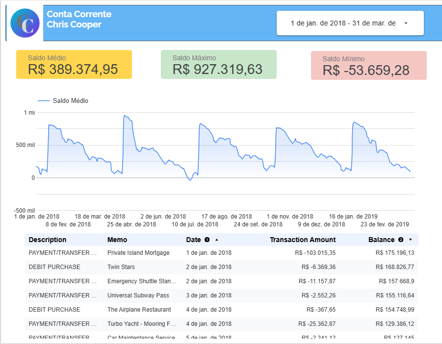

# 📊 Análise de Conta Corrente com Python

Projeto desenvolvido para analisar transações bancárias de um arquivo CSV, realizando limpeza de dados, cálculos de saldo e geração de gráficos de gastos.

## 📊 Visualização de Dados (Looker Studio)
Abaixo, a representação visual dos gastos consolidada através do Looker Studio:

## 🛠️ Tecnologias
- Python 3.12
- Pandas (Manipulação de dados)
- Matplotlib (Visualização)

## 📈 Funcionalidades
- Limpeza de caracteres especiais ($ e ,)
- Cálculo de entradas, saídas e saldo final
- Identificação de maiores gastos
- Gráfico de barras por categoria
